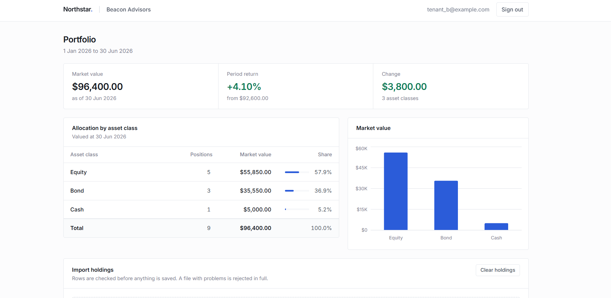
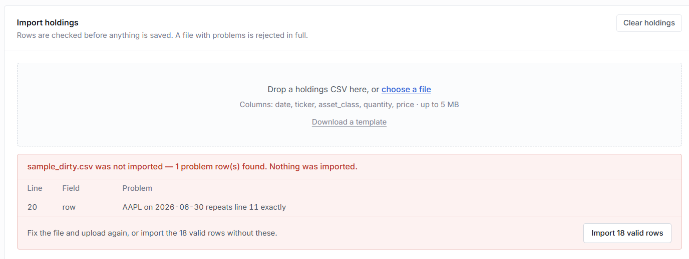
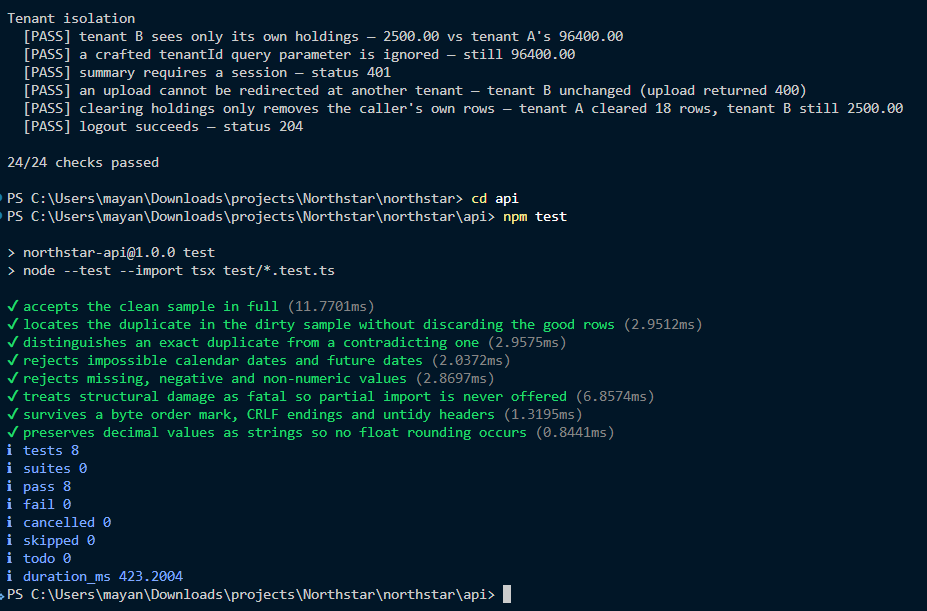
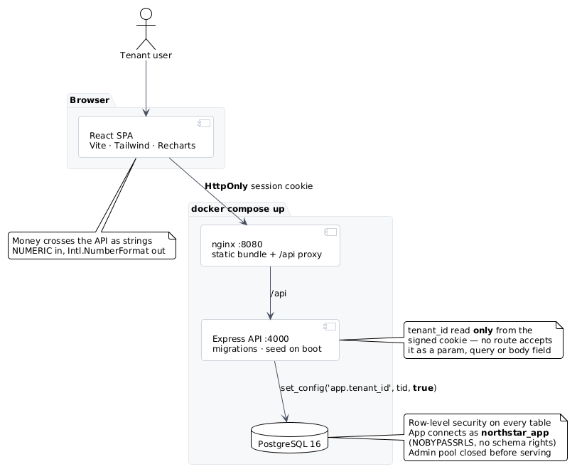
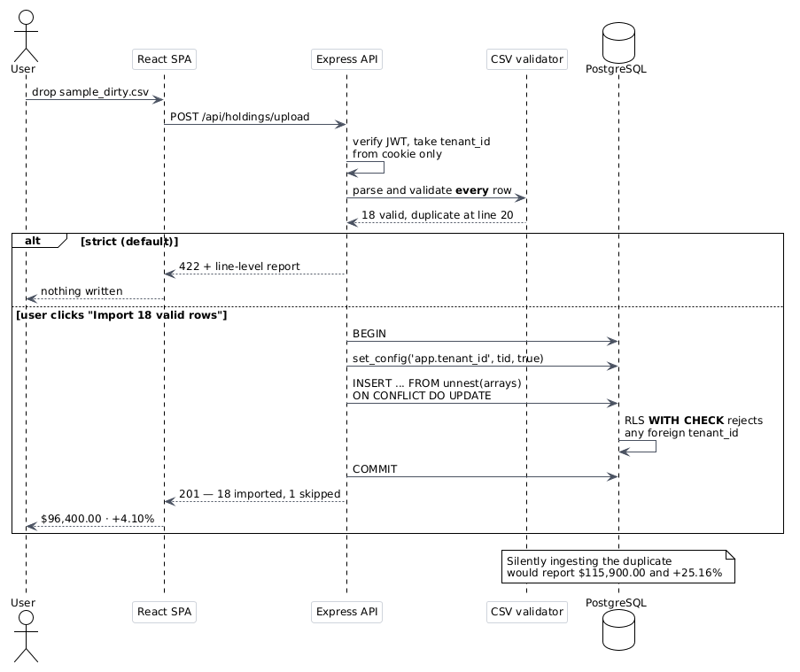
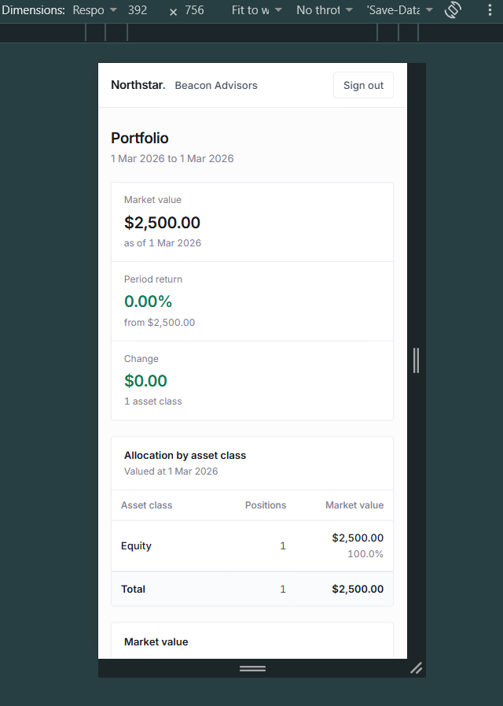

# Northstar Portfolio

Investment tracking tool. A client firm signs in, uploads a CSV of its holdings, and sees total market value, the split by asset class, and the return over the period. Firms cannot see each other's data.

React · TypeScript · Vite · Tailwind · Express · PostgreSQL 16 · Docker

**Live:** [<vercel-url>](https://northstar-for-optimiz-alpha.vercel.app) · **API:** (https://northstar-api-nqmr.onrender.com/healthz)



## Run it

Needs Docker Desktop running.

```bash
git clone https://github.com/Tanishq-Choudhary/Northstar-For-OptimizAlpha.git && cd northstar
docker compose up --build
```

Note: This is for bash. Powershell doesn't recognise && so write 'cd northstar' in next line if using it. 

Open **http://localhost:8080**. Database, tables and demo accounts are created on first boot.

| Email | Password | Firm |
|---|---|---|
| `tenant_a@example.com` | `Password123!` | Alpha Capital |
| `tenant_b@example.com` | `Password123!` | Beacon Advisors |

Upload `data/sample_good.csv` to get **$96,400.00** and **+4.10%**. Then try `data/sample_dirty.csv`.

`docker compose down -v` resets everything. Without Docker: Node 22, PostgreSQL 16, copy `.env.example`, then `npm install && npm run dev` in `api/` and `web/`.

## Bad data

`sample_dirty.csv` has one row repeated. Imported silently it reports $115,900.00 and +25.16% instead of $96,400.00 and +4.10%, and nothing on screen would look wrong.

The whole file is checked before any row is saved. If anything fails, nothing is imported and the bad lines are listed. Importing just the valid rows is possible but has to be chosen.



| In the file | Result |
|---|---|
| Identical row twice | Rejected, both line numbers given |
| Same holding twice, different price | Rejected, worded as a contradiction rather than a duplicate |
| `2026-02-30` | Rejected. February has no 30th, so a format check alone misses it |
| Date in the future | Rejected |
| Blank ticker, price or quantity | Rejected, field and line named |
| `abc` where a number belongs | Rejected |
| Negative quantity | Rejected |
| Row missing a column | Rejected as unreadable, no partial import offered |
| Column missing from the header | Rejected before any row is read |
| Headers but no rows | Rejected as empty |
| Saved out of Excel | Imported. Excel adds a hidden marker and different line endings |
| Untidy headers like `" Date "` or `TICKER` | Imported, tidied automatically |
| Same valid file uploaded three times | One set of holdings, not three |
| Over 5 MB, or not a `.csv` | Rejected before reading |
| Prices with many decimals | Kept exactly, no rounding |
| Only one date in the file | 0% return instead of an error |
| Portfolio starting at zero | Dash, since the percentage is undefined |

## Isolation

Which firm you are is answered only by the signed session. No URL, form field or parameter feeds into it, so there is nothing to tamper with. Separately, PostgreSQL refuses to return another firm's rows even if the application asks for them.

```bash
node scripts/verify-isolation.mjs   # 24 end-to-end checks
cd api && npm test                  # 8 checks on the CSV reader, no database
```

The checks include forging a session token to claim the other firm, adding a firm ID to the URL, pointing an upload at the other firm, and running a delete with no filter.



## Architecture







## Decisions

**Client data is protected twice.** The firm ID comes only from the session cookie, never from a request. PostgreSQL row-level security enforces the same rule again, and the app connects with a restricted account that cannot bypass it. Application queries carry no firm filter at all, so the database is doing the work rather than sitting behind a check nobody would notice failing.

**Money avoids decimal number types.** Computers store fractions approximately, which is why `0.1 + 0.2` is not `0.3`. Over thousands of rows that becomes a real discrepancy. Amounts are stored and calculated as exact decimals throughout. Market value is derived by the database, so it cannot drift from the quantity and price it came from.

**The session cookie is unreadable to scripts.** A hostile script in the page cannot copy it and replay it elsewhere. That shifts the risk to cross-site requests, which is handled by restricting who may call the service. Failed sign-ins are throttled, and an unknown email takes as long to reject as a wrong password so accounts cannot be discovered by timing.

**Misconfiguration stops the service.** Config is validated at boot. No silent fallback to a default secret, and production will not start with a development one.

**One command brings it all up.** Each service waits for the one below it, and migrations run automatically. Docker is the only prerequisite.

## Assumptions

An upload updates the dates it covers and leaves others alone, so correcting one month cannot wipe another. Replacing everything each time would also be defensible.

The period comes from the file: earliest date to latest.

Asset classes are stored as written, so `Equity` and `equity` list separately. Merging them needs an agreed vocabulary, which was out of scope.

Quantities cannot be negative, so short positions are not supported.

Demo accounts exist only when a setting turns them on.

## Next

Sign out would end the session on every device, not just the current one.

The sign-in attempt limit would be shared across servers rather than held per server.

Uploads would record who ran them and be reversible. Currently an import cannot be traced afterwards.

Tests would run against a disposable database on every change, confirming a deliberately unfiltered query still cannot reach another firm's rows.

Large files would stream into the database instead of buffering. Safe at 5 MB, not at 500.
